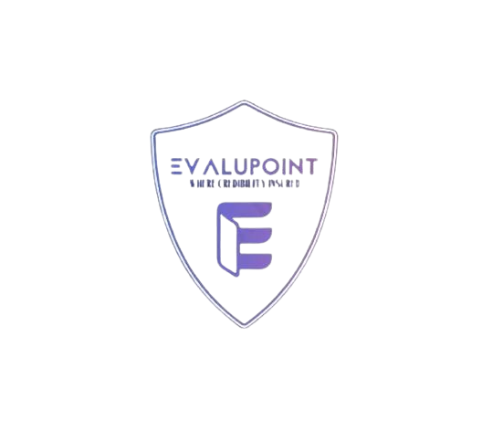

## Evalupoint

## Overview

The project aims to address challenges in online learning by offering a service that enhances the credibility of certifications from various platforms. Learners can receive constructive feedback on their projects after each chapter, ensuring active engagement and skill development. Additionally, reviewers earn volunteer hours recorded on the national volunteer portal, fostering a supportive learning community.

## Features

- Project Uploads
- Interactive Feedback System
- Volunteer Hour Recording

## Technologies Used

- "react": "^18.2.0",
- "bootstrap": "^5.3.3"
- "react-bootstrap": "^2.10.1",

## Installation

- Clone the repository

git clone https://github.com/arwaalkhathlan/Sc.git

- Install dependencies

npm install
